# DSO202 — Practical 1 Report

**Setting Up a Local Kubernetes Cluster with kind, and Deploying First Workloads**

Student name: `Dupchu Wangmo`

Student ID: `02230282`

## 1. Objective

The objective of this practical is to learn how to set up the local Kubernetes environment from scratch, upon which the rest of DSO202 is going to be built, and get familiar with the necessary

kubectl commands for deploying, describing, and debugging applications running on Kubernetes. Using

kind (Kubernetes IN Docker), a three-node cluster was spun up: one control-plane and two worker nodes, from which the scheduler places the workloads deployed as part of this practical, in order to observe their placement directly.

NodePort Services to get a sense of how to expose a set of Pods with dynamically-allocated IP addresses behind a single static IP address. The practical was focused on one simple application, nginx , serving a static page, to illustrate the Kubernetes abstractions and their interplay without getting distracted by the details of the application itself

## 3. Procedure and Observations

### 3.1 Stage 0 - Prerequisites and Verification

**What was done:** Before creating any cluster, the three required tools - Docker, `kind`, and `kubectl` -  were verified independently, so that any failure could be attributed to a single cause rather than guessed at. The Docker daemon was confirmed to be running and reachable with `docker info`, the installed `kind` release was confirmed with `kind version`, and the `kubectl` client was confirmed with `kubectl version --client` (using `--client` because no cluster existed yet to query).

**Screenshot:**

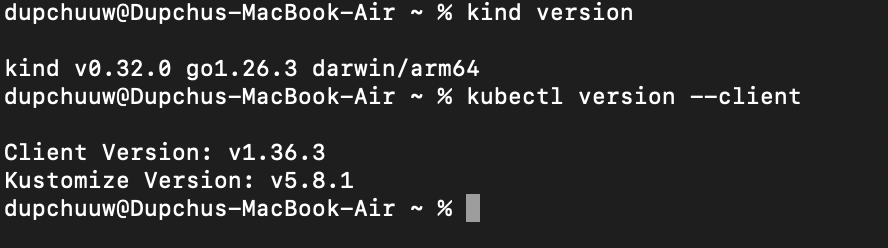

**Observation:** All three tools reported compatible versions before any cluster was created, isolating the environment as a variable so that any later failure could be attributed to Kubernetes configuration rather than a missing or misconfigured tool.

### 3.2 Stage 1 - Creating the Three-Node Cluster

**What was done:** Listing 1 (`cluster/kind-cluster.yaml`) was copied into `cluster/kind-cluster.yaml` and used to create the cluster with `kind create cluster --config cluster/kind-cluster.yaml`. This configuration defines one control-plane node and two worker nodes, all backed by Docker containers named `dso202-control-plane`, `dso202-worker`, and `dso202-worker2`. A `kubeadmConfigPatches` block in the file renames the underlying Kubernetes **Node objects** (as distinct from the Docker container names) to `control-plane`, `worker-node-1`, and `worker-node-2`, and applies custom labels (`dso202/node-role`, `dso202/node-index`) to each worker. The control-plane node also publishes host port `30080` into the container, in preparation for the NodePort Service created later in Stage 6. After creation, `kind get clusters`, `kind get nodes --name dso202`, and `docker ps` were used to confirm the cluster and its three backing containers existed, and `kubectl config current-context` was used to confirm `kubectl` had automatically switched to the new `kind-dso202` context.

**Screenshot — cluster creation:**

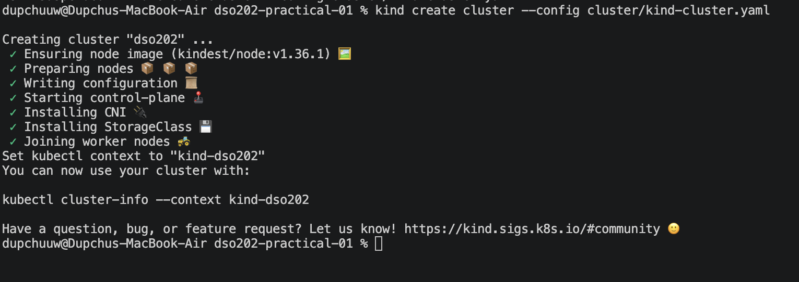

**Screenshot — docker ps showing three node containers:**

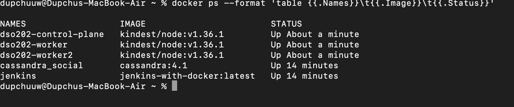

**Observation:** The Docker container names (`dso202-control-plane`, `dso202-worker`, `dso202-worker2`) and the Kubernetes Node object names (`control-plane`, `worker-node-1`, `worker-node-2`) are two independent naming systems — the former fixed by `kind`, the latter set by the `kubeadmConfigPatches` in Listing 1 and confusing the two is a common source of error in later `kubectl` commands.

### 3.3 Stage 2 - Inspecting the Cluster and Its Components

**What was done:** With the cluster running, its control-plane and node components were located and inspected as real, queryable objects rather than as a diagram. `kubectl cluster-info` was used to locate the API server address (randomised per cluster by `kind`). `kubectl get nodes` and `kubectl get nodes -o wide` listed the three Node objects along with their status, roles, internal IPs, OS image, and container runtime (`containerd`). `kubectl describe node worker-node-1` was used to read one node's full detail, in particular its custom labels (set by Listing 1), its reported capacity/allocatable resources, and the Pods currently scheduled onto it. `kubectl get namespaces` listed the five namespaces present on a fresh cluster (`default`, `kube-system`, `kube-public`, `kube-node-lease`, `local-path-storage`), and `kubectl get pods -n kube-system -o wide` listed the control-plane components themselves - `etcd`, `kube-apiserver`, `kube-controller-manager`, and `kube-scheduler` -  each running exactly once, only on the control-plane node, alongside `kube-proxy` and `kindnet`, which run once per node as DaemonSets.

**Screenshot - kubectl get nodes -o wide:**

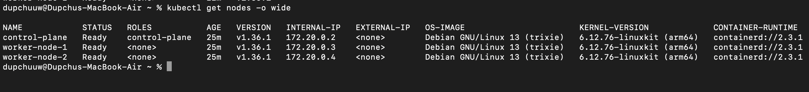

**Screenshot - kube-system pods:**

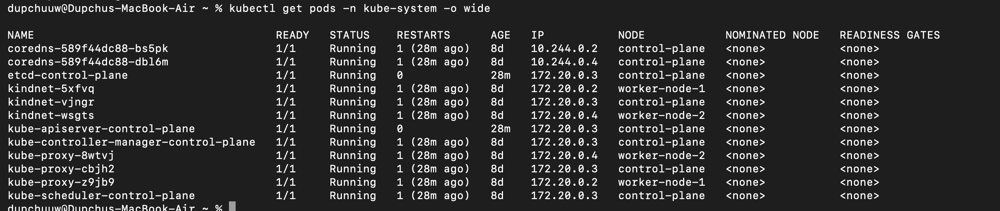

**Observation:** `etcd`, `kube-apiserver`, `kube-controller-manager`, and `kube-scheduler` each appear exactly once, only on the control-plane node, while `kube-proxy` and `kindnet` appear once per node — the practical difference between a single control-plane component and a component that must run everywhere as a DaemonSet.

### 3.4 Stage 3 - Namespaces, ResourceQuota, and LimitRange

**What was done:** A namespace was initially created by imperative means using kubectl create namespace just to see what happens, and was then deleted, since the artefact to be graded is the declarative one. Listing 2 (manifests/00-namespace.yaml) was then applied to create the dso202-practical namespace with appropriate labels and annotations, and kubectl context’s default namespace was set to it using kubectl config set-context --current --namespace=dso202-practical , so that subsequent commands do not need -n. Listing 3 (manifests/01-quota-and-limits.yaml) was applied next, which contains two objects defined in one file: a ResourceQuota which sets a cap on total number of CPU/memory requests and limits, and pod/service/configmap/secret counts in the namespace, and a LimitsRange which specifies what are the default CPU/memory requests and limits that should be applied to any container in the namespace that does not set them explicitly, and which disallows any value outside a min-max range. To verify that the LimitsRange was applied successfully, a pod was created using kubectl run with no resource declarations, and then the command kubectl get pod … -o jsonpath was used to output the pod’s spec, proving that the LimitsRange’s defaults had been applied. Because they had, the pod would not have been rejected by the ResourceQuota , which would have happened otherwise

**Screenshot - ResourceQuota and LimitRange describe output:**

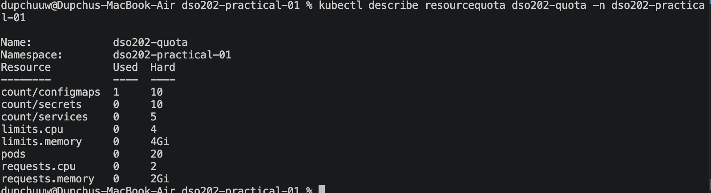

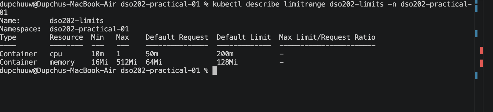

**Screenshot - LimitRange defaulting proof (limitrange-check pod):**

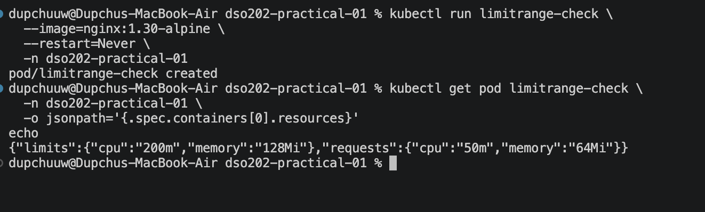

**Observation:** A Pod created with no resource declaration at all was stored with a full set of CPU/memory requests and limits, confirming the LimitRange's defaults were applied automatically - without it, the same Pod would have been rejected outright by the ResourceQuota's compute caps.

### 3.5 Stage 4 - Pods

**What was done:** Pod was initially created imperatively with kubectl run web-imperative --image=nginx:1.30-alpine --restart=Never --port=80 --labels=..., watched with kubectl get pod --watch until it transitions from ContainerCreating to Running , and exported to YAML with kubectl get pod ... -o yaml to see what all the cluster adds (status, node, service account, tolerations, ...) that a manifest would not normally have. The pod was then deleted. Listing 4 ( manifests/02-pod-web.yaml ) was applied as the declarative equivalent, and applied a second time to see it report unchanged , demonstrating idempotency. kubectl get pod web-pod -o wide confirmed the node it was scheduled on and its internal (non-host) pod IP. kubectl describe pod web-pod was used to read the Events : timeline of the scheduler assigning the pod to a node and the kubelet pulling the image and launching the container. Labels were then explored with kubectl get pods --show-labels , label selectors (-l app=web , set-based selectors), adding and removing a label at runtime, and adding an annotation to show the difference between that and a label. The four core troubleshooting commands were then walked through: logs , exec -it ... - sh (since alpine uses sh , not bash ), exec (without -it ) for one-off commands, and port-forward to expose the pod on a local port for testing without a service.

**Screenshot - web-pod Running with labels:**

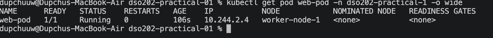

**Screenshot - kubectl exec shell session:**

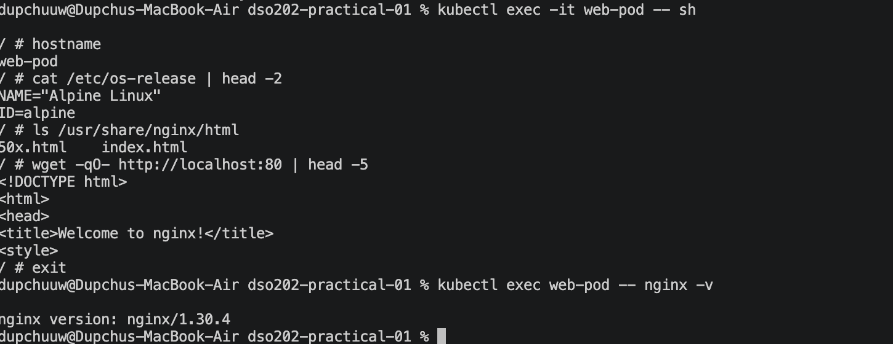

**Screenshot - port-forward + curl from second terminal:**

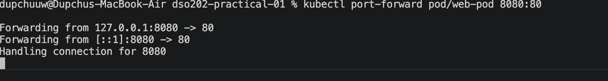

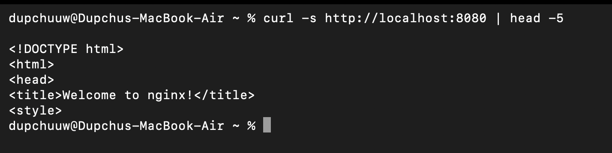

**Observation:** The `Events:` section of `kubectl describe pod` showed the scheduler and the kubelet as two distinct actors — `default-scheduler` chose the node, and `kubelet` performed every step after that (pulling the image, creating and starting the container) - which is the first place to check when a Pod misbehaves.

### 3.6 Stage 5 - Deployments

**What was done:** Listing 5 (manifests/03-deployment-web.yaml) was applied to create web-deployment with 3 replicas. All replicas became available, as checked with kubectl rollout status. The chain of ownership was observed by running kubectl get deployment,replicaset,pod -l app=web. Deployment web-deployment owns a ReplicaSet with a name formed by the Deployment name and a hash of the ReplicaSet Pod template, which in turn owns the Pods, each named with the ReplicaSet name plus a random suffix. This could also be seen by reading the ownerReferences field of the ReplicaSet. Self-healing was verified by deleting one Pod, and observing it being recreated seconds later by the ReplicaSet, not the Deployment. The Deployment’s replica count was changed with kubectl scale to 5, then changed back in the manifest and reapplied to make the Deployment recognize the change and return to the desired state. A rolling update was triggered by running kubectl set image with the new image nginx:1.31-alpine (with change-cause annotation added to the Deployment’s rollout history) and watched with kubectl rollout status. It could be seen that new Pods were being created before old ones were shut down, as a result of max-unavailable: 0 in the manifest. kubectl rollout history was used to view the history of the Deployment, and then kubectl rollout undo was used to revert to the previous version. Finally, an invalid image nginx:9.99-does-not-exist was set to cause a failed rollout. As a result, since max-unavailable: 0 was set in the manifest, the three healthy Pods were not terminated, and the rollout was aborted, as seen with kubectl describe pod. The problem was fixed with kubectl rollout undo, and the manifest was applied again, with kubectl diff showing that the live cluster configuration matched the file.

**Screenshot - Deployment/ReplicaSet/Pod ownership chain:**

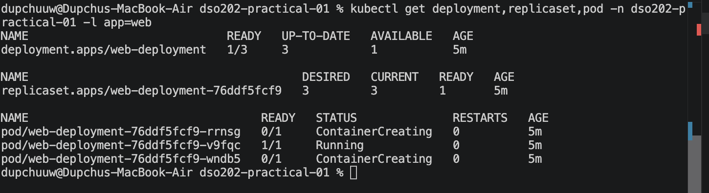

**Screenshot - self-healing (before/after pod deletion):**

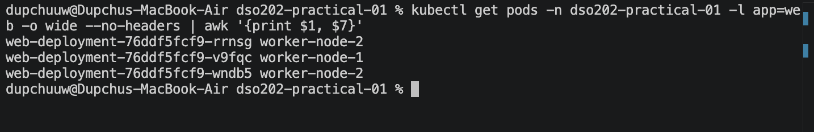

**Screenshot - rollout history:**

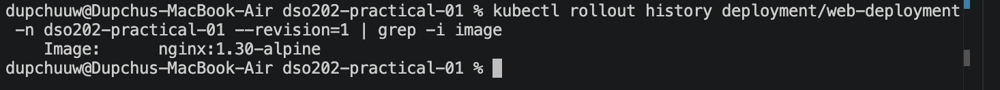

**Screenshot - failed rollout (ImagePullBackOff) and recovery:**
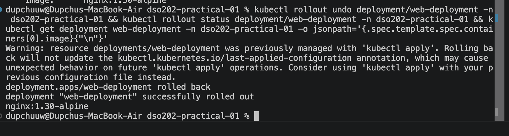

**Observation:** Because `maxUnavailable: 0` was set on the rollout strategy, the deliberately broken image rollout stalled in `ImagePullBackOff` without ever removing the three healthy, already-running Pods - converting what could have been an outage into a safely diagnosable, reversible stall.

### 3.7 Stage 6 - Services

**What was done:** Listing 6 (`manifests/04-service-clusterip.yaml`) was applied to create `web-clusterip`, a **ClusterIP** Service selecting the Deployment's Pods by their `app`/`tier` labels. `kubectl get endpointslice -l kubernetes.io/service-name=web-clusterip` confirmed the EndpointSlice controller had populated the Service's backing addresses with the three ready Pod IPs. Listing 8 (`manifests/06-pod-client.yaml`) was applied to create a diagnostic `client-pod`, from which `kubectl exec client-pod -- nslookup web-clusterip` confirmed DNS resolution to the Service's stable ClusterIP (following the `<service>.<namespace>.svc.cluster.local` naming pattern), and repeated `wget` requests through the Service demonstrated load balancing across all three backing Pods (each Pod's `index.html` was overwritten with its own hostname to make the distribution observable). Readiness-based traffic gating was then demonstrated by deleting one Pod's `index.html` so its readiness probe began failing: the Pod remained `Running` but was removed from the EndpointSlice and stopped receiving traffic until the file — and therefore the probe — was restored. A Service with a deliberately mismatched selector was also created and shown to produce an empty EndpointSlice, the diagnostic signature of a selector fault. Listing 7 (`manifests/05-service-nodeport.yaml`) was then applied to create `web-nodeport`, fixed to `nodePort: 30080` to match the host port published by Listing 1, and `curl http://localhost:30080` from the host machine (with no port-forward running) confirmed the Service was reachable from outside the cluster, via the control-plane container's published port, through `kube-proxy`, to a ready Pod on a worker node. Finally, a `LoadBalancer`-type Service was created and shown to remain permanently `<pending>`, since `kind` has no cloud provider to fulfil that request.

**Observation:** An empty EndpointSlice was the consistent diagnostic signature of both a Pod failing its readiness probe and a Service selector matching no Pods at all - in both cases the Service's DNS name still resolved correctly, showing that the fault lay in Pod-to-Service matching rather than in DNS or the network path.

### 3.8 Stage 7 - Cleanup and Reproducibility

**What was done:** Final evidence was captured before any deletion, using `kubectl get all -o wide`, `kubectl get resourcequota,limitrange,endpointslice -o wide`, `kubectl get nodes -o wide`, and `kubectl get events --sort-by=.lastTimestamp`, redirected into files under `evidence/`. The workload objects were then deleted declaratively, in the reverse order to their creation, using `kubectl delete -f` against each individual manifest file (client Pod, NodePort Service, ClusterIP Service, Deployment, Pod) — deliberately using the same files that created the objects, so that no object created outside version control could go undetected. `kubectl get all` then confirmed the namespace was empty apart from the ResourceQuota and LimitRange. Everything was then rebuilt in a single command, `kubectl apply -f manifests/`, which applies every file in the directory in lexical order (the reason for the numeric filename prefixes), proving the entire practical is reproducible from the repository alone. The default namespace was reset to `default`, and finally `kind delete cluster --name dso202` removed the cluster and its three backing Docker containers entirely, confirmed with `kind get clusters` and `docker ps`. 

**Screenshot - full rebuild from manifests/ directory:**

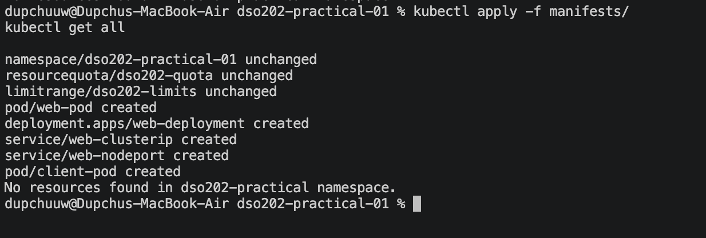

**Screenshot - cluster deleted (kind get clusters empty):**

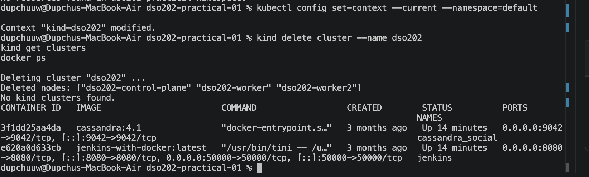

**Observation:** A single `kubectl apply -f manifests/` command, run against an otherwise-empty namespace, fully reconstructed every workload object created during the practical - the strongest available evidence that the repository, and not the state of the laptop, is what actually defines the deployed system.

## 4. Reflection

**What was difficult:**

After completing this practical, it was difficult to distinguish Docker container names from Kubernetes. I also had hard to understanding why the LimitRange was required before the resourceQuota would allow bare Kubectl run pods. 
`

**An error I encountered, and how I diagnosed it:**

During the practical, I received a NotFound error stating that the dso202-practical namespace did not exist when I tried to apply the Pod manifest. I checked the available namespaces using kubectl get namespaces and found that the required namespace had not been created. I resolved the issue by applying manifests/00-namespace.yaml first and then applying the remaining manifests in the correct order. This helped me understand that Kubernetes objects cannot be created inside a namespace that does not already exist.

`

