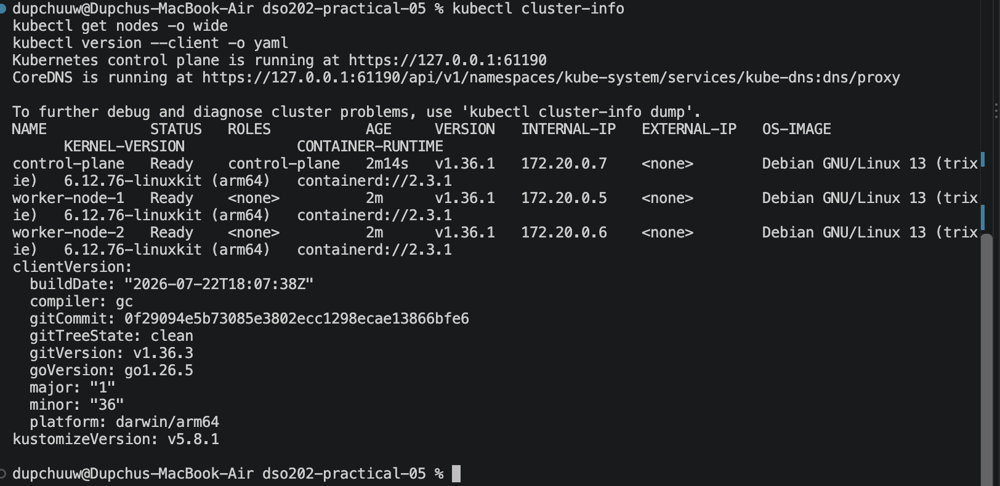
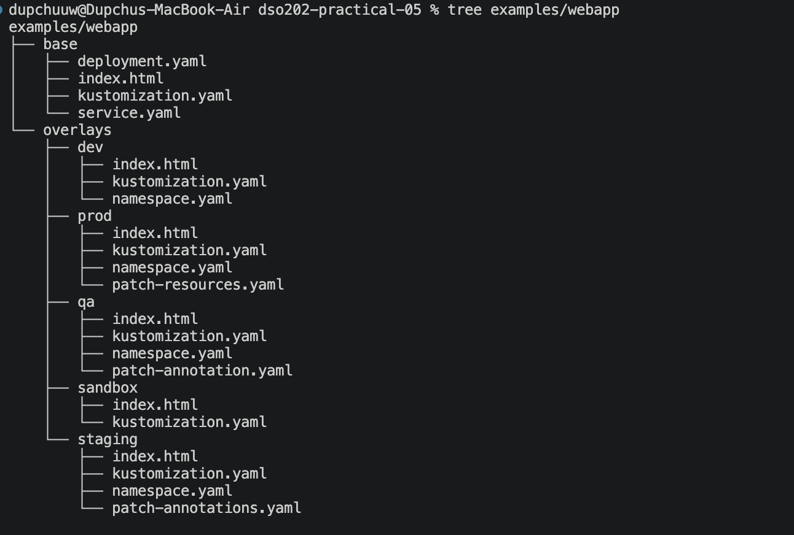
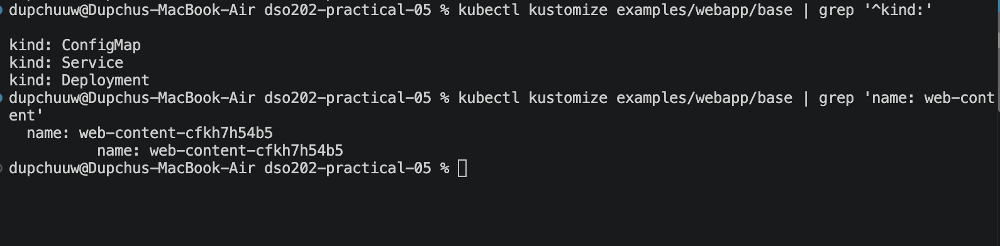
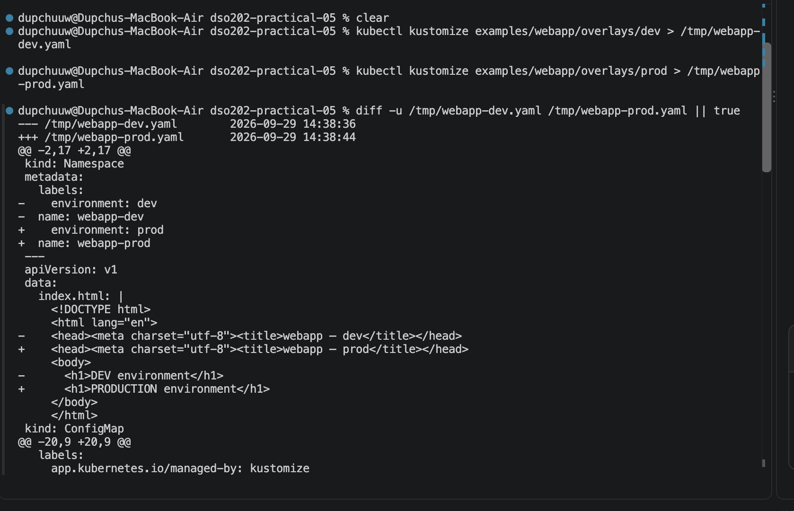
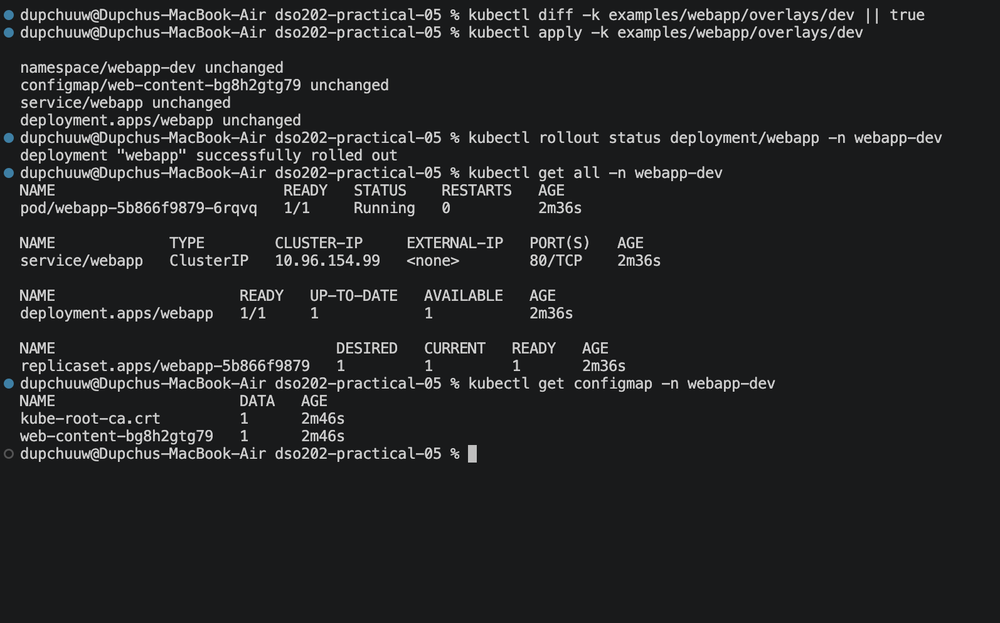
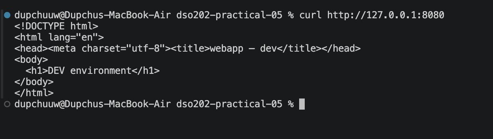
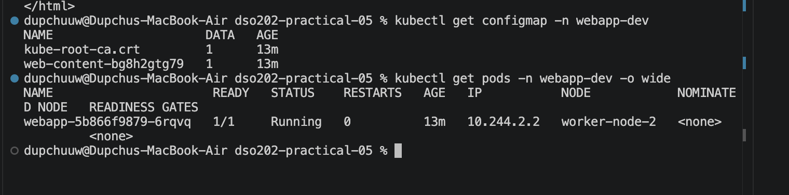
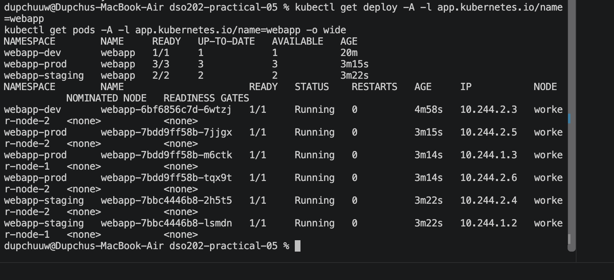
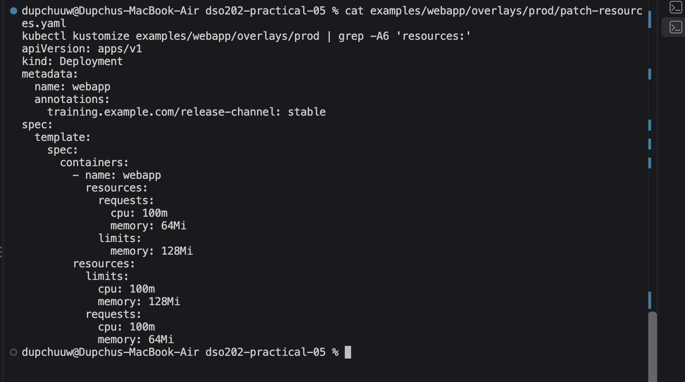
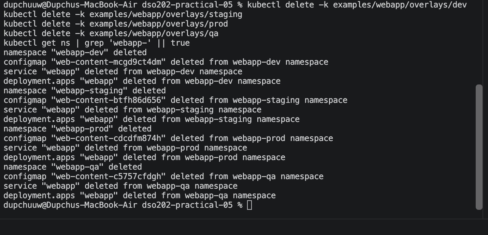

# DSO202 — Practical 5 Report

**Environment-Specific Configuration with Kustomize on Kind**

Name: Dupchu Wangmo

Student Number: 02230282

## 1. Objective

Running the same application in several environments with copied manifests
creates drift: a fix lands in one copy and is forgotten in the others, and
comparing environments means reading whole files. The objective of this
practical was to remove that duplication with Kustomize: keep the Deployment
and Service in one **base**, express each environment as a small **overlay**,
and let Kustomize produce the final YAML.

Specifically, to:

- render a base and several overlays;
- deploy dev, staging and prod without copying the base Deployment or Service;
- use `namespace`, `labels`, `replicas`, `images`, `configMapGenerator` and patches;
- observe the generated-ConfigMap hash triggering a rollout;
- follow render → diff → apply → verify for every change;
- write a new QA overlay with a JSON 6902 patch;
- diagnose Kustomize problems from rendered output.

---

## 2. Environment


The cluster `dso202-p5` has three nodes named after the handout topology
(`control-plane`, `worker-node-1`, `worker-node-2`), set through
`kubeadmConfigPatches` in `cluster/kind-cluster.yaml`.

### Container images

| Image | Environment |
| --- | --- |
| `nginxinc/nginx-unprivileged:1.25-alpine` | base, prod, qa |
| `nginxinc/nginx-unprivileged:1.26-alpine` | staging (`images:`) |
| `nginxinc/nginx-unprivileged:1.27-alpine` | dev (`images:`) |

### Base design

The base follows standard Kubernetes practice rather than a minimal example:
recommended `app.kubernetes.io/*` labels, readiness and liveness probes on a
named port, a `RollingUpdate` strategy with `maxUnavailable: 0`, and a
restricted security context (non-root UID 101, no privilege escalation, all
capabilities dropped, read-only root filesystem with an `emptyDir` for `/tmp`).
The Service exposes port 80 and targets the container port by name (`http`,
8080), so the container port can change without touching the Service.


## 3. Procedure and Observations

### 3.1 Task 0 — Pre-flight

```bash
kind create cluster --config cluster/kind-cluster.yaml
kubectl wait --for=condition=Ready nodes --all --timeout=180s
kubectl cluster-info
kubectl get nodes -o wide
kubectl version --client -o yaml
```



**Evidence: `01-task0-preflight`.** The context is `kind-dso202-p5`; the API
server answers on ⟨address⟩. All three nodes are `Ready` on ⟨version⟩. The
client reports Kustomize ⟨version⟩, confirming support for `-k` and
`kubectl kustomize`.

### 3.2 Task 1 — Reading the repository before running it

```bash
tree examples/webapp
```


**Evidence: `02-task1-repo-tree`.** `deployment.yaml` and `service.yaml` exist
only under `base/`. Each overlay holds a `kustomization.yaml`, a
`namespace.yaml`, its own `index.html` and, where needed, one patch file.
(Answers to the task questions: Section 4, Q1.)

### 3.3 Task 2 — Rendering the base

```bash
kubectl kustomize examples/webapp/base | grep '^kind:'
kubectl kustomize examples/webapp/base | grep 'name: web-content'
```


```
kind: ConfigMap
kind: Service
kind: Deployment
```

```
  name: web-content-cfkh7h54b5
          name: web-content-cfkh7h54b5
```

Three kinds are rendered: ConfigMap, Service and Deployment. The generated
ConfigMap is `web-content-cfkh7h54b5`; the hash suffix is `cfkh7h54b5`. The
same name appears a second time, further indented, inside the Deployment's
`volumes[].configMap.name`. The base `deployment.yaml` only says
`web-content`, so this shows Kustomize rewrote the reference to match the
generated name.
(Checkpoint: Section 4, Q2.)

### 3.4 Task 3 — Comparing dev and prod without touching the cluster

```bash
kubectl kustomize examples/webapp/overlays/dev  > /tmp/webapp-dev.yaml
kubectl kustomize examples/webapp/overlays/prod > /tmp/webapp-prod.yaml
diff -u /tmp/webapp-dev.yaml /tmp/webapp-prod.yaml || true
```



| # | Difference | dev | prod | Declared in |
| --- | --- | --- | --- | --- |
| 1 | Namespace | `webapp-dev` | `webapp-prod` | `namespace:` |
| 2 | `environment` label (metadata and Pod template) | `dev` | `prod` | `labels:` |
| 3 | Replicas | 1 | 3 | `replicas:` |
| 4 | Image tag | `1.27-alpine` | `1.25-alpine` | `images:` |
| 5 | Requests | 50m / 32Mi | 100m / 64Mi | `patch-resources.yaml` |
| 6 | Memory limit | 64Mi | 128Mi | `patch-resources.yaml` |
| 7 | Page content → ConfigMap name | `web-content-bg8h2gtg79` | `web-content-cdcdfm874h` | `index.html` + generator |
| 8 | Annotation | — | `release-channel: stable` | `patch-resources.yaml` |

The new ConfigMap name shows up in two places in the diff: on the ConfigMap
itself and in the Deployment's `volumes[].configMap.name`. The `environment`
label changes on all four objects (Namespace, ConfigMap, Service, Deployment)
and in the Pod template, because the overlays set `includeTemplates: true`.
Everything else in the Deployment, including the probes, security context,
rolling-update strategy and `limits.cpu: 100m`, is identical in both
environments and does not appear in the diff at all. Every changed line traces
back to a few lines in the prod overlay; no duplicated manifest had to be read.

### 3.5 Task 4 — Deploying dev safely

```bash
kubectl kustomize examples/webapp/overlays/dev
kubectl diff -k examples/webapp/overlays/dev || true
kubectl apply -k examples/webapp/overlays/dev
kubectl rollout status deployment/webapp -n webapp-dev
kubectl get all -n webapp-dev
kubectl get configmap -n webapp-dev
```



On a first deploy, `kubectl diff` fails with
`Error from server (NotFound): namespaces "webapp-<env>" not found`. The diff
is a server-side dry run: the API server is asked to place each namespaced
object in its namespace, and that namespace does not exist yet because it is
part of the same overlay. The error is expected and harmless. For a first
deploy, the local render is the real preview; from the second apply onward,
`kubectl diff` works normally (as in Task 6).

`apply` created the Namespace, ConfigMap `web-content-bg8h2gtg79`, Service
`webapp` and Deployment `webapp`. The rollout completed with 1/1 ready; the
Pod only became Ready once its readiness probe on `/` succeeded. The
Deployment keeps the base name `webapp`; the namespace separates environments.
The single Pod, `webapp-5b866f9879-6rqvq`, was scheduled on `worker-node-2`
(Pod IP `10.244.2.2`). No image preload was needed: the nodes pulled
`nginxinc/nginx-unprivileged:1.27-alpine` from Docker Hub directly.

```
⟨paste kubectl get all -n webapp-dev⟩
```

### 3.6 Task 5 — Reaching the application

```bash
kubectl port-forward -n webapp-dev service/webapp 8080:80
curl http://127.0.0.1:8080
```



```html
<!DOCTYPE html>
<html lang="en">
<head><meta charset="utf-8"><title>webapp — dev</title></head>
<body>
  <h1>DEV environment</h1>
</body>
</html>
```

The page title and heading both identify the dev environment, so the Pod is
serving the content from the dev overlay's generated ConfigMap. Traffic went local 8080 → Service port 80 →
container port `http` (8080).

### 3.7 Task 6 — Proving the ConfigMap hash → rollout chain

`overlays/dev/index.html` was changed to `<h1>DEV v2 — configuration changed</h1>`,
rendered, then applied.



| | Before | After |
| --- | --- | --- |
| Generated ConfigMap | `web-content-bg8h2gtg79` | `web-content-mcgd9ct4dm` |
| Pod | `webapp-5b866f9879-6rqvq` (worker-node-2) | `webapp-6bf6856c7d-6wtzj` (worker-node-2) |
| ReplicaSet | `webapp-5b866f9879` (now 0/0) | `webapp-6bf6856c7d` (1/1) |

Rendering before applying already showed the new name,
`web-content-mcgd9ct4dm`, in both the ConfigMap and the Deployment's volume
reference. The `apply` output then confirmed the chain from the cluster's side:

```
namespace/webapp-dev unchanged
configmap/web-content-mcgd9ct4dm created
service/webapp unchanged
deployment.apps/webapp configured
```

The ConfigMap was `created`, not `configured`, because to Kubernetes it is a
brand-new object with a new name. The Deployment was `configured` because its
Pod template now references that new name. The Namespace and Service were
`unchanged`, since nothing in them depends on the page content.

`kubectl rollout status` reported *"1 old replicas are pending termination"*.
This is the `maxUnavailable: 0` strategy at work: the new Pod had to pass its
readiness probe before the old Pod was allowed to terminate, so the page was
never unavailable.

`kubectl get rs` shows two ReplicaSets: `webapp-5b866f9879` scaled to 0 and
`webapp-6bf6856c7d` at 1/1. The Pod name changed completely, from
`webapp-5b866f9879-6rqvq` to `webapp-6bf6856c7d-6wtzj`; the middle part is
the ReplicaSet's pod-template hash, so a different value is direct proof that
the Pod template changed. The old ReplicaSet is kept (up to
`revisionHistoryLimit: 5`) so that `kubectl rollout undo` can return to it.

Both ConfigMaps remain in the namespace: `web-content-bg8h2gtg79` is no longer
referenced by anything, but `kubectl apply` does not prune objects that have
left the rendered output.
(Chain explanation: Section 4, Q3.)

### 3.8 Task 7 — Deploying staging and prod

```bash
kubectl diff -k examples/webapp/overlays/staging || true
kubectl apply -k examples/webapp/overlays/staging
kubectl diff -k examples/webapp/overlays/prod || true
kubectl apply -k examples/webapp/overlays/prod
kubectl get deploy -A -l app.kubernetes.io/name=webapp
kubectl get pods -A -l app.kubernetes.io/name=webapp -o wide
```

```
Error from server (NotFound): namespaces "webapp-staging" not found
namespace/webapp-staging created
configmap/web-content-btfh86d656 created
service/webapp created
deployment.apps/webapp created
```

The first diff of each new overlay hit the same `NotFound` error as dev, for
the same reason (Section 3.5). The apply then created exactly the four objects
the render had shown. The prod ConfigMap was created as
`web-content-cdcdfm874h`, the same name as in the Task 3 render, which confirms
the render is an exact preview of what reaches the cluster.



```
NAMESPACE        NAME     READY   UP-TO-DATE   AVAILABLE   AGE
webapp-dev       webapp   1/1     1            1           20m
webapp-prod      webapp   3/3     3            3           3m15s
webapp-staging   webapp   2/2     2            2           3m22s
```

| Environment | Replicas | Image tag | ConfigMap | Pods per node |
| --- | --- | --- | --- | --- |
| dev | 1 | 1.27-alpine | `web-content-mcgd9ct4dm` | worker-node-2: 1 |
| staging | 2 | 1.26-alpine | `web-content-btfh86d656` | worker-node-1: 1, worker-node-2: 1 |
| prod | 3 | 1.25-alpine | `web-content-cdcdfm874h` | worker-node-1: 1, worker-node-2: 2 |

One label query found the Deployment in every namespace, because the base puts
`app.kubernetes.io/name: webapp` on the Deployment's own metadata as well as
the Pod template. The scheduler spread the replicas of each multi-replica
Deployment across `worker-node-1` and `worker-node-2`; no application Pod ran
on the control-plane, which carries the standard control-plane taint.

### 3.9 Task 8 — What the prod patch changed



The patch sets only three resource
values (`requests.cpu`, `requests.memory`, `limits.memory`) and matches the
container by `name: webapp`. Rendered prod resources:

```yaml
resources:
  limits:
    cpu: 100m        # base — not mentioned in the patch
    memory: 128Mi    # patch
  requests:
    cpu: 100m        # patch
    memory: 64Mi     # patch
```

(Answers: Section 4, Q4.)

### 3.10 Task 9 — The QA overlay

Files written: `namespace.yaml`, `index.html`, `patch-annotation.yaml`,
`kustomization.yaml` (see `examples/webapp/overlays/qa/`). The patch:

```yaml
- op: add
  path: /metadata/annotations/training.example.com~1owner
  value: qa-team
```


Rendered before applying:

```yaml
  annotations:
    training.example.com/managed-by: kustomize
    training.example.com/owner: qa-team
```

Both annotations are present: the base's `managed-by` is kept and the patch's
`owner` is added. The apply followed the same first-deploy pattern as the
other environments:

```
Error from server (NotFound): namespaces "webapp-qa" not found
namespace/webapp-qa created
configmap/web-content-c5757cfdgh created
service/webapp created
deployment.apps/webapp created
Waiting for deployment "webapp" rollout to finish: 0 of 2 updated replicas are available...
Waiting for deployment "webapp" rollout to finish: 1 of 2 updated replicas are available...
deployment "webapp" successfully rolled out
```

Reading the annotations back from the API server:

```bash
kubectl get deployment webapp -n webapp-qa -o jsonpath='{.metadata.annotations}' | tr ',' '\n'
```

ended with

```
"training.example.com/managed-by":"kustomize"
"training.example.com/owner":"qa-team"}
```

The other two annotations in that output are added by Kubernetes itself:
`deployment.kubernetes.io/revision` by the Deployment controller, and
`kubectl.kubernetes.io/last-applied-configuration` by `kubectl apply`, which
stores the applied manifest to compute future diffs. The live Deployment also
confirmed 2 replicas, `environment: qa`,
namespace `webapp-qa`, and ConfigMap `web-content-c5757cfdgh`. QA has no
`images:` entry, so it runs the base tag `1.25-alpine`, and it has no resource
patch, so it keeps the base requests and limits.

### 3.11 Challenge extension — `namePrefix` on a sandbox overlay

Prediction written before rendering, then checked:

| Field | Predicted | Rendered | Match |
| --- | --- | --- | --- |
| Deployment | `sandbox-webapp` | `sandbox-webapp` |  done |
| Service | `sandbox-webapp` | `sandbox-webapp` | done |
| ConfigMap | `sandbox-web-content-<hash>` | `sandbox-web-content-8g2b5b4k4h` | done|
| Deployment volume reference | follows ConfigMap | `sandbox-web-content-8g2b5b4k4h` | done|
| Label and selector values | unchanged | `app.kubernetes.io/name: webapp` | done |
| Container name | unchanged | `webapp` | done |
| Volume names, port name | unchanged | `content`, `tmp`, `http` | done |
| Namespace | unchanged | `webapp-sandbox` | done |


Every prediction matched. Two observations go beyond the prediction:

- The Deployment and the Service both became `sandbox-webapp`, yet the Service
  still selects the Pods. The Service finds Pods through the *label value*
  `app.kubernetes.io/name: webapp`, which is not a resource name and was left
  alone. Had the prefix been applied to labels too, the selector would still
  match only because it would change on both sides; applying it to one side
  alone would break the Service.
- The hash suffix did not change. Rendering the same overlay with the
  `namePrefix` line removed produced `web-content-8g2b5b4k4h`, the same hash.
  The hash is computed from the ConfigMap's content, and the prefix is added
  to the name afterwards, so a prefix alone never triggers a rollout.

(Discussion: Section 4, Q6.)

### 3.12 Task 10 — Cleanup

```bash
for env in dev staging prod qa; do kubectl delete -k examples/webapp/overlays/$env; done
kubectl get ns | grep 'webapp-' || true
```


```
namespace "webapp-dev" deleted
configmap "web-content-mcgd9ct4dm" deleted from webapp-dev namespace
service "webapp" deleted from webapp-dev namespace
deployment.apps "webapp" deleted from webapp-dev namespace
...
```

Each `delete -k` removed the four objects in that overlay's current render,
and the final `grep` returned nothing, so no `webapp-` namespace remained.

The delete output lists only `web-content-mcgd9ct4dm` for dev, not the old
`web-content-bg8h2gtg79` from before Task 6: `delete -k` deletes what the
overlay renders *now*, and the old ConfigMap is no longer part of that. It
was removed anyway, because deleting the `webapp-dev` Namespace deletes every
object inside it. Without the Namespace in the overlay, that orphaned
ConfigMap would have had to be deleted by hand.


## 4. Analysis

**Q1. Which files exist once, which values differ, and where are the differences?**

Only `base/` holds a Deployment, a Service, a default page and the generator
definition. The values that vary are namespace, `environment` label, replicas,
image tag, page content, prod resources and annotations. Each lives in the
overlay: scalar changes in `kustomization.yaml` fields (`namespace`, `labels`,
`replicas`, `images`), content in the overlay's `index.html`, and structural
changes in one patch file per overlay.

**Q2. Why is the generated ConfigMap not named exactly `web-content`?**

`configMapGenerator` appends a hash of the ConfigMap's contents and rewrites
every reference to it. Content and name become tied together: new content
means a new name. Pods mount ConfigMaps by name, so a new name is the only
reliable way to make a Deployment notice that its configuration changed.

**Q3. The chain from file change to rollout, in my own words.**

⟨Write this in your own words — it is marked as mandatory. Cover: the edit
changes the generator's data → the hash, and therefore the name, changes →
Kustomize rewrites the Deployment's volume reference → that field is inside
`spec.template`, so the Pod template differs → the Deployment controller
creates a new ReplicaSet and replaces the Pods. Mention your real before/after
hashes and Pod names.⟩

**Q4. Deleted or merged? Who owns the policy? Why a patch instead of a copy?**

Merged: `limits.cpu: 100m` survives although the patch never mentions it. A
strategic merge patch overwrites only the fields it names, and it matched the
container by its `name` (`webapp`), not by position. The policy is owned by
the prod overlay, in `patch-resources.yaml`. A copied Deployment would silently
miss every later base change (a new probe, label or security setting), while
the patch keeps prod's difference to a few reviewable lines.

**Q5. Strategic merge vs JSON 6902 — and when to use each.**

| | Strategic merge | JSON 6902 |
| --- | --- | --- |
| Form | Partial manifest | List of operations at JSON Pointer paths |
| Targeting | By kind and name inside the patch | Explicit `target:` in the kustomization |
| Lists | Merged by key (container `name`) | Addressed by index |
| Removing a field | Awkward | `op: remove` |
| Risk | Low; readable | Path typos, `~1` escaping, `add` can replace a whole map |

Strategic merge suits "set these fields" changes such as prod resources.
JSON 6902 suits precise edits a merge cannot express, such as removing a field,
changing one list element by index, or, as in QA, adding one exact key.

**Q6. What is the real learning target of `namePrefix`?**

Reference-aware transformation. Kustomize knows which fields are references to
other objects' names (`volumes[].configMap.name`, among others) and rewrites
them along with the names. Plain strings such as label values, the container
name and port names are left alone, which is why the Service's selector still
matches the Pods. A text find-and-replace of `webapp` would have broken it.


## 5. Reflection

### What was difficult

⟨Your own experience.⟩

### Errors met, and how they were diagnosed

**1. `kind load docker-image` failed with "content digest … not found".**
Preloading the NGINX images into the kind nodes failed for all three tags.
Docker Desktop stores pulled images as a multi-platform index but had only
downloaded the arm64 layers; `kind load` exports and imports *all* platforms,
so the import stopped at a digest belonging to a platform that was never
downloaded. Since the pulls themselves had succeeded, Docker Hub was
reachable, so the preload was skipped and the nodes pulled the images
directly. (A fallback would have been
`docker save --platform linux/arm64 … -o file.tar` followed by
`kind load image-archive file.tar`.)

**2. A JSON 6902 patch that silently deleted an annotation.** Written as

```yaml
- op: add
  path: /metadata/annotations
  value:
    training.example.com/owner: qa-team
```

the patch rendered without any error, and the new annotation appeared:

```yaml
  annotations:
    training.example.com/owner: qa-team
  labels:
    app.kubernetes.io/component: frontend
```

Comparing with the base showed that `training.example.com/managed-by: kustomize`
had disappeared. In JSON Patch, `add` on a path that already exists replaces the
value there, so the whole annotations map was overwritten. The fix was to add
one key instead, escaping the `/` in the key as `~1`
(`/metadata/annotations/training.example.com~1owner`). This mistake produced
no error from Kustomize and would have been accepted by the API server; only
reading the rendered output caught it.


## 6. References

1. Kubernetes Documentation — Declarative Management of Kubernetes Objects Using Kustomize. https://kubernetes.io/docs/tasks/manage-kubernetes-objects/kustomization/
2. Kustomize — kustomization.yaml reference. https://kubectl.docs.kubernetes.io/references/kustomize/kustomization/
3. Kubernetes Documentation — Recommended Labels. https://kubernetes.io/docs/concepts/overview/working-with-objects/common-labels/
4. Kubernetes Documentation — Pod Security Standards. https://kubernetes.io/docs/concepts/security/pod-security-standards/
5. kind — Configuration. https://kind.sigs.k8s.io/docs/user/configuration/
6. RFC 6902 — JSON Patch. https://datatracker.ietf.org/doc/html/rfc6902
7. RFC 6901 — JSON Pointer. https://datatracker.ietf.org/doc/html/rfc6901

